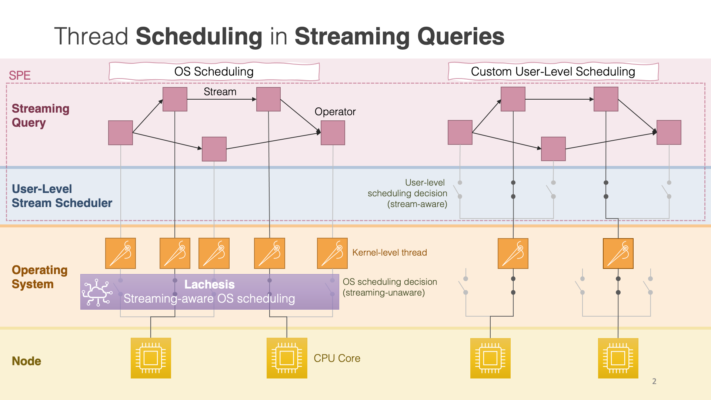

# Lachesis: A Middleware for Customizing OS Scheduling of Stream Processing Queries

> *In Greek mythology [Lachesis](https://en.wikipedia.org/wiki/Lachesis) was one of the three Moirai (Fates). She measured the thread of life allotted to each person with her measuring rod.*
> 

This repository only contains the implementation of Lachesis, from the publication:
> Dimitris Palyvos-Giannas, Gabriele Mencagli, Marina Papatriantafilou, and Vincenzo Gulisano. 2021. **Lachesis: a middleware for customizing OS scheduling of stream processing queries**. In Proceedings of the 22nd International Middleware Conference (Middleware '21). Association for Computing Machinery, New York, NY, USA, 365–378. DOI:https://doi.org/10.1145/3464298.3493407

See the [conference presentation from ACM Middleware 2021](https://www.youtube.com/watch?v=YPMhcfSzG6A) for more details.

The evaluation platform and related artifacts are found [here](https://github.com/dmpalyvos/lachesis-evaluation).

